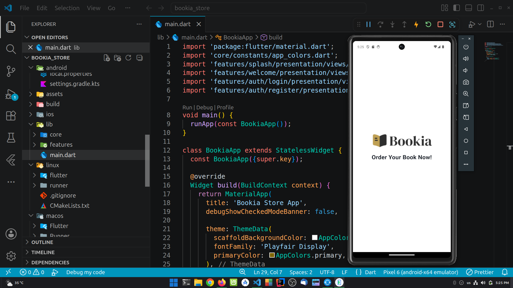
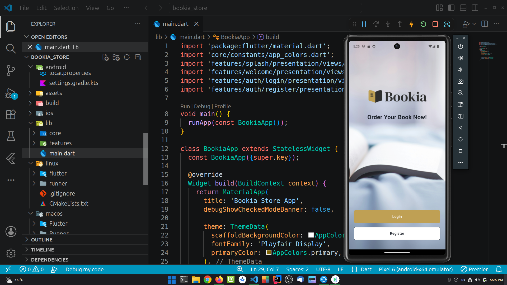
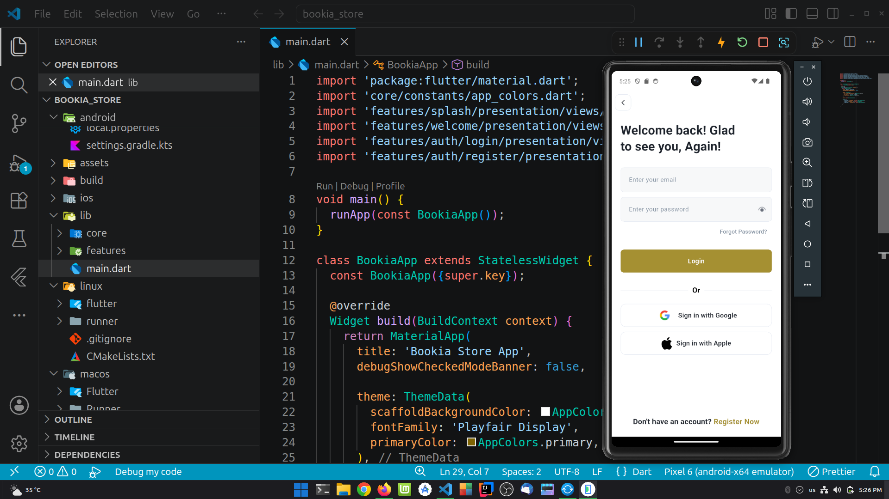
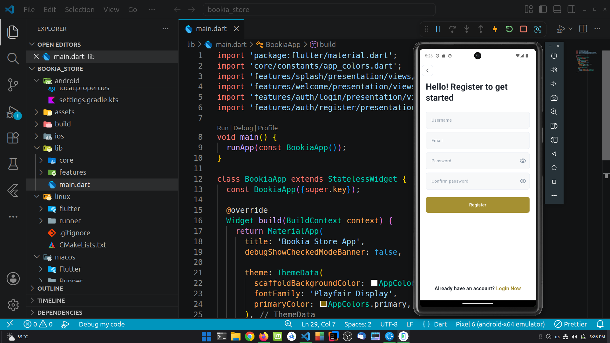

# 📚 Bookia Store

A modern Flutter application for browsing and discovering books with a clean, responsive, and user-friendly interface.

---

## 📱 Screenshots






> Replace the images above with your own screenshots.

---

## ✨ Features

- 🔐 User Authentication (Login & Register)
- 📚 Browse Books
- 🔍 Search Books
- 📖 Book Details
- ❤️ Clean & Modern UI
- 📱 Responsive Design
- 🚀 Smooth User Experience

---

## 🛠️ Built With

- Flutter
- Dart
- Material Design
- REST API (if applicable)
- Clean Project Structure

---


---

## 🚀 Getting Started

### Prerequisites

- Flutter SDK
- Dart SDK
- Android Studio or VS Code

---

### Installation

Clone the repository:

```bash
git clone https://github.com/your-username/bookia_store.git
```

Go to the project folder:

```bash
cd bookia_store
```

Install dependencies:

```bash
flutter pub get
```

Run the application:

```bash
flutter run
```

---

## 📦 Dependencies

```yaml
flutter
cupertino_icons
font_awesome_flutter
```

> Add any additional packages you use.

---

## 📸 Screenshots Folder

Create a folder named:

```text
screenshots/
```

Then add your images:

```text
screenshots/
├── 1.png
├── 2.png
├── 3.png
└── 4.png
```

GitHub will automatically display them in the README.

---

## 🎯 Future Improvements

- Firebase Authentication
- Google Sign-In
- Apple Sign-In
- Favorites
- Shopping Cart
- Payment Integration
- Dark Mode
- Notifications
- Backend Integration

---

## 👨‍💻 Developer

**Montaser Karam**

Flutter Developer

- Passionate about building modern mobile applications.
- Focused on writing clean, maintainable Flutter code.
- Continuously learning and improving.

---

## ⭐ Support

If you like this project, consider giving it a **⭐ Star** on GitHub.

---

## 📄 License

This project is licensed under the MIT License.

---

<p align="center">
Made with ❤️ using Flutter
</p>